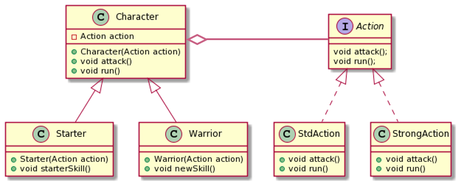

# Bridge Pattern
- 클래스의 기능과 구현을 분리한다.

## 기능과 구현
### 1. 기능
- Parent의 하위클래스를 만들어 기능을 추가한다.
```
class Parent{
    void func1(){...}
}
class Child extends Parent{
    //기능 추가-newFunc
    void newFunc(){...}
}
```

### 2. 구현
-  상위 클래스 or 인터페이스 : 인터페이스를 규정함
- 하위 클래스 : 위의 인터페이스를 구현함
```
interface Parent{
    void func();
}
class Child implements Parent{
    //구현
    void func(){...}
}
```

## Example

```
class Character{
    private Action action; //bridge 역할
    public Character(Action action) {
        this.action = action;
    }
    public void attack() {
        action.attack();
    }
    public void run(){
        action.run();
    }
}

class Starter extends Character{
    public Starter(Action action) {
        super(action);
    }
    //기능 추가
    public void starterSkill(){
        System.out.println("starter: up to lev10");
    }
}

class Warrior extends Character{
    public Warrior(Action action) {
        super(action);
    }
    //기능 추가
    public void newSkill(){
        System.out.println("warrior: use sword");
    }
}

//구현 클래스
interface Action{
    void attack();
    void run();
}

class StdAction implements Action{
    @Override
    public void attack() {
        System.out.println("attack: 10");
    }

    @Override
    public void run() {
        System.out.println("run: speed 10");
    }
}

class StrongAction implements Action{
    @Override
    public void attack() {
        System.out.println("attack: 20");
    }

    @Override
    public void run() {
        System.out.println("run: speed 20");
    }
}
...
public static void main(String[] args) {
    Starter character1 = new Starter(new StdAction());
    Warrior character2 = new Warrior(new StrongAction());
    character1.attack();
    character1.starterSkill();

    character2.attack();
    character2.newSkill();
    
    //출력
    //attack: 10
    //starter: up to lev10
    //attack: 20
    //warrior: use sword
}
```

- Character : 기능 클래스의 최상위
- Starter, Warrior : 기능 클래스
- Action : 구현 인터페이스의 최상위
- StdAction, StringAction : 인터페이스를 구현하는 클래스
- 기능과 구현을 분리했는데, Character 클래스 안의 Action 멤버가 기능과 구현을 연결하는 다리역할을 한다.