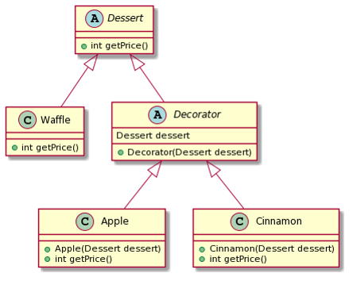

# Decorator Pattern
- 객체를 합성해서 기능을 확장시킬 수 있다.
- 추가 기능을 Decorator 클래스에 정의한다.
- 상속을 통한 기능 확장도 가능하지만 기능들을 조합해야할 경우, 경우의 수가 많아진다.
- 예) java의 BufferedReader
	- `BufferedReader br = new BufferedReader(new InputStreamReader(System.in));`

## Example

```
abstract class Dessert{
    public abstract int getPrice();
}

class Waffle extends Dessert{
    @Override
    public int getPrice() {
        return 2000;
    }
}

abstract class Decorator extends Dessert{
    Dessert dessert; //Wrapping 하고자하는 객체
    public Decorator(Dessert dessert) {
        this.dessert = dessert;
    }
}

class Apple extends Decorator{
    public Apple(Dessert dessert) {
        super(dessert);
    }

    @Override
    public int getPrice() {
        //기능 확장
        return dessert.getPrice() + 500;
    }
}

class Cinnamon extends Decorator{
    public Cinnamon(Dessert dessert) {
        super(dessert);
    }

    @Override
    public int getPrice() {
        //기능 확장
        return dessert.getPrice() + 300;
    }
}
...
public static void main(String[] args) {
    Dessert waffle = new Waffle();
    waffle = new Apple(waffle);
    System.out.println(waffle.getPrice()); //2500

    Dessert waffle2 = new Apple(new Cinnamon(new Waffle()));
    System.out.println(waffle2.getPrice()); //2800
}
```

- 상속을 이용했다면 사과와플/시나몬와플/사과+시나몬와플 클래스를 구현해야한다. 추가토핑이 많아지면 클래스 수는 조합 수만큼 많아질 것이다.