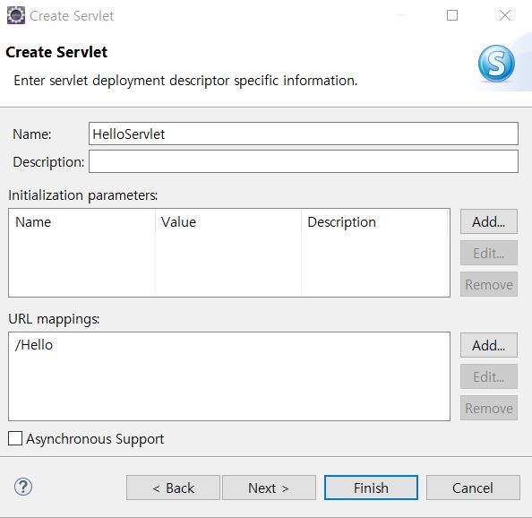

# Start JSP & Servlet

## 0. Setting
- Download JDK, IDE(Eclipse, IntelliJ ...), Web Container(Apache Tomcat)
- Create Server
```
Window - Show View - Servers => [No servers are available. Click this link to create a new server...] - [Apache - Tomcat v8.5 Server] - Next - [톰캣 설치위치 지정 & JRE 선택] - Finish
```


#### 서버 추가설정
1. Server 탭에서 서버 더블클릭
2. Server Locations - Use Tomcat installation 선택
- 톰캣이 설치된 path로 연결
3. Server Options - Publish module contexts to separate XML files 체크
- 개발자가 외부 xml 설정파일을 사용할 수 있다.
4. Ports - HTTP/1.1 의 Port Number 변경가능

## 1. Create project
- New - Dynamic Web Project - 프로젝트 이름 입력 - Next - Next - [Generate web.xml deployment descriptor 체크] - Finish 

## 2. Create JSP
- WebContent에 생성

※ The superclass "javax.servlet.http.HttpServlet" was not found on the Java Build Path 오류 발생 시
```
프로젝트 우클릭 - Properties - Project Facets - Java클릭 - Runtimes - 서버 체크 - Apply and Close
```


※ Multiple annotations found at this line: ... 오류 발생 시
```
프로젝트 우클릭 - Build Path - Configure Build Path... - Libraries 탭 - "JRE System Library" Remove - Add Library... - JRE System Library - Apply and Close
```

## 3. Create Servlet
- Java Resources 에 생성


- Java package 입력 : 웹사이트 주소를 반대로 한 이름을 쓴다.
	- ex) com.xxx.yyy
- Class Name 입력



- URL mappings 선택하고 Edit - 원하는 mapping 입력
	- 위에서는 `http://localhost:port/JspPractice/Hello` 가 mapping된다.