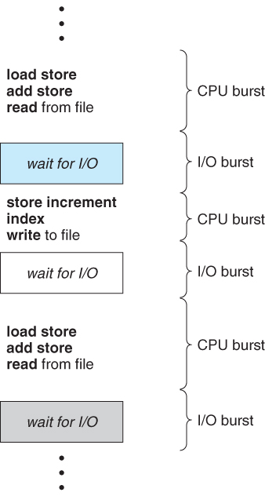



# CPU Scheduling

> CPU를 프로세스 간에 교환하면서 생산성↑

## 1. Basic Concepts

> 프로세스 대기 -> CPU는 놀게 됨
>
> -> CPU 사용을 양도받을 수 있음

#### 1) CPU-I/O 버스트 사이클

- 프로세스 실행 = [CPU 실행 + I/O 대기] 의 사이클

  = CPU 버스트 -> I/O 버스트 -> CPU 버스트 -> I/O 버스트 -> CPU 버스트 -> ... -> CPU 버스트 -> 실행 종료

  

- 프로세스에서 짧은 CPU 버스트가 많음

- I/O 중심의 프로그램 - 짧은 CPU 버스트를 많이 가짐

- CPU 지향 프로그램 - 긴 CPU 버스트를 가질 수 있음

#### 2) CPU 스케줄러

- CPU가 유휴상태 -> 준비 큐에서 프로세스 하나 실행

  => 실행할 프로세스를 선택하는 건 **CPU 스케줄러**

- 큐에 있는 레코드는 일반적으로 PCB

#### 3) 선점 및 비선점 스케줄링

- CPU 스케줄링을 결정하는 상황
  1. 프로세스가 실행 -> 대기 상태로 전환
  2. 프로세스가 실행 -> 준비완료 상태로 전환
  3. 프로세스가 대기 -> 준비완료 상태로 전환
  4. 프로세스 종료
- 1, 4번의 상황: 비선점
- 2,3번의 상황: 선점
