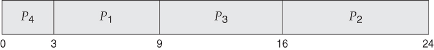
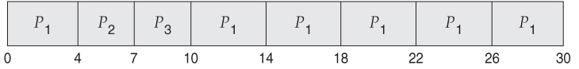
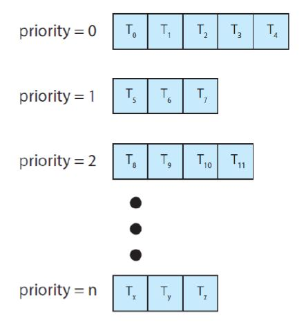

# CPU Scheduling

> CPU를 프로세스 간에 교환하면서 생산성↑


## 1. Basic Concepts

> 프로세스 대기 -> CPU는 놀게 됨
>
> -> CPU 사용을 양도받을 수 있음

#### 1) CPU-I/O 버스트 사이클

- 프로세스 실행 = [CPU 실행 + I/O 대기] 의 사이클

  = CPU 버스트 -> I/O 버스트 -> CPU 버스트 -> I/O 버스트 -> CPU 버스트 -> ... -> CPU 버스트 -> 실행 종료

  

- 프로세스에서 짧은 CPU 버스트가 많음

- I/O 중심의 프로그램 - 짧은 CPU 버스트를 많이 가짐

- CPU 지향 프로그램 - 긴 CPU 버스트를 가질 수 있음

#### 2) CPU 스케줄러

- CPU가 유휴상태 -> 준비 큐에서 프로세스 하나 실행

  => 실행할 프로세스를 선택하는 건 **CPU 스케줄러**

- 큐에 있는 레코드는 일반적으로 PCB

#### 3) 선점 및 비선점 스케줄링

- CPU 스케줄링을 결정하는 상황
  1. 프로세스가 실행 -> 대기 상태로 전환
  2. 프로세스가 실행 -> 준비완료 상태로 전환
  3. 프로세스가 대기 -> 준비완료 상태로 전환
  4. 프로세스 종료
- 1, 4번의 상황: 비선점
- 2,3번의 상황: 선점

- 선점의 경우 생길 수 있는 문제

  ```
  1. A 프로세스 - [(자료 공유) x=10, y=20] - B 프로세스
  
  2. A 프로세스에서 x,y 수정 중
  
  3. B 프로세스 실행 -> x, y 읽기
  
  4. x, y => ??? (A와 B 각각에서 일관성 x)
  ```


#### 4) 디스패처

`CPU 코어의 제어 → CPU 스케줄러가 고른 프로세스에게 줌`

- 포함하는 작업

  - 문맥 교환
  - 사용자 모드로 전환
  - 프로그램 재시작을 위해 프로그램의 적절한 위치로 이동하는 일

- 디스패치 지연

  - 디스패치는 프로세스 문맥 교환 시 호출됨

    → 제일 빨리 실행돼야함

  - 디스패치 지연: 프로세스 정지 ~ 프로세스 수행시작 사이 소요시간


## 2. 스케줄링 기준

- 스케줄링 알고리즘 선택 전, 각 알고리즘의 특성 확인 필요

1. CPU 이용률
   - 최대한 CPU를 바쁘게 유지하는 것이 이상적
   - 실제로는 40% ~ 90% 범위를 가져야 함
2. 처리량
   - 처리량 = (완료된 프로세스 개수) / (단위 시간)
3. 총처리 시간
   - 프로세스의 제출 시간과 완료 시간의 간격
   - 준비 큐에서 대기한 시간 + CPU에서 실행한 시간 + I/O시간
4. 대기 시간
   - 준비 큐에서 대기하면서 보낸 시간의 합
5. 응답 시간
   - request 후 response가 오기까지의 시간

- 대부분의 경우 **평균 측정 시간**을 최적화하려고 함
- 경우에 따라 최소, 최대를 최적화하는 것이 좋을수도 있음


## 3. 스케줄링 알고리즘

- 준비 큐에 있는 프로세스 중 어떤 것을 CPU에 할당할지 결정

#### 1) 선입 선처리 스케줄링

> First-Come, First-Served (FCFS)
>
> 먼저 요청하는 프로세스에 CPU 할당

- 선입선출 큐로 쉽게 관리 가능

- CPU가 가용상태가 되면 준비 큐의 앞에 있는 프로세스에 할당

- 단점: 평균대기 시간이 길어질 수 있음

  - 예시 (간트 차트)

  ※ 간트 차트: 참여한 각 프로세스의 시작/종료 시각을 포함해 스케줄 기법을 도시하는 막대차트

  

  

  - 위 그림에서 평균 대기 시간 = (0 + 24 + 27) / 3 = 17
  - 아래 그림에서 평균 대기 시간 = (0 + 3 + 6) / 3 = 3

  

- 호위 효과: 하나의 프로세스가 CPU를 양도하기를 모든 프로세스가 기다리는 것

  => 짧은 프로세스가 먼저 처리되도록 허용될 때보다 CPU와 장치 이용률이 저하됨

- 비선점형 -> 한 번 CPU가 할당되면 (프로세스 종료 or I/O 등)으로 CPU를 방출할 때까지 CPU 점유


#### 2) 최단 작업 우선 스케줄링

> Shortest-Job-First
>
> 가장 작은 CPU 버스트를 가진 프로세스에 CPU 할당

- 두 프로세스가 같은 CPU 버스트 -> FCFS

- 예시

  | 프로세스 | CPU 버스트 |
  | -------- | ---------- |
  | P1       | 6          |
  | P2       | 8          |
  | P3       | 7          |
  | P4       | 3          |

  

  

- 최소의 평균대기 시간을 가짐
- 선점형이 될 수도, 비선점형이 될 수도 있음
  - 새로 준비 큐로 들어온 프로세스가 현재 프로세스보다 짧은 CPU  버스트를 가지면 새로 들어온 프로세스에 CPU를 할당


#### 3) 라운드로빈 스케줄링

> 시간 할당량을 정해 한 프로세스 당 (시간 할당량)동안만 CPU를 할당

- 예시

  | 프로세스 | CPU 버스트 |
  | -------- | ---------- |
  | P1       | 24         |
  | P2       | 3          |
  | P3       | 3          |

  

  - 시간할당량을 4로 잡은 경우 (처음 4초)-P1 -> P2, P3가 각각 4초 안에 종료 -> P1 종료까지 CPU 할당

- 시간 할당량이 매우 크면 선입 선처리 스케줄링과 같음

- 시간 할당량이 작으면 많은 문맥 교환이 발생


#### 4) 우선순위 스케줄링

> 가장 높은 우선순위를 가진 프로세스에 CPU 할당

- SJF는 우선순위 스케줄링의 한가지 경우 (우선순위를 CPU버스트시간으로 결정)
- 우선순위의 기준: 측정 가능한 것
  - 시간 제한, 메모리 요구, 열린 파일 수, (평균 I/O 버스트) / (평균 CPU 버스트)
- 외부적 우선순위: 프로세스의 중요성, 컴퓨터 사용을 위한 비용, 작업을 후원하는 부서 등
- 우선순위에 따라 선점형, 비선점형 둘 다 가능
- 우선순위 스케줄링의 문제: `무한 봉쇄`, `기아 상태`
  - 우선순위가 낮은 프로세스가 무한히 대기하는 경우 (우선순위가 높은 프로세스가 꾸준히 들어옴)
  - 해결 방안 중 하나: `노화(aging)`
    - 오랫동안 대기하는 프로세스들의 우선순위를 증가시킨다.


#### 5) 다단계 큐 스케줄링

> 우선순위마다 다른 큐를 사용하여 관리

- 예시

  

- 라운드 로빈과 결합한 경우 한 큐의 프로세스마다 시간 할당량 적용
- 각 큐마다 **다른 스케줄링 방식**을 적용시킬 수 있음


#### 6) 다단계 피드백 큐 스케줄링

> 프로세스가 들어간 큐에서 고정된 것이 아니라, 다른 큐로 이동할 수 있음

- CPU 버스트가 크면 우선순위가 낮은 큐로 이동할 수 있음
- 오래 기다리는 프로세스의 경우 우선순위가 높은 큐로 이동할 수 있음
- 스케줄러는 다음 매개변수에 의해 정의됨
  - 큐의 개수
  - 각 큐에 적용되는 스케줄링 알고리즘
  - 다른 큐로 언제 이동할지 결정하는 방법
  - 프로세스에 서비스를 필요로 할 때 프로세스가 들어갈 큐를 결정하는 방법


## 4. 스레드 스케줄링

- 스케줄되는 대상은 커널 스레드

#### 1) 경쟁 범위

- 프로세스 경쟁 범위 (PCS): 같은 프로세스에 속한 스레드 간 경쟁
- 시스템 경쟁 범위 (SCS): 시스템 상 모든 스레드 간 경쟁


## 5. 다중 처리기 스케줄링

> 여러 개의 코어를 가진 경우의 CPU 스케줄링


#### 1) 다중 처리기 스케줄링에 대한 접근법

- 비대칭 다중 처리: 하나의 마스터 서버(처리기)가 모든 스케줄링, I/O, 시스템의 활동 관리

  - 간단하지만 병목의 위험

- 대칭 다중 처리(SMP): 각 프로세서가 스스로 스케줄링 할 수 있음

  - 전략1. 모든 스레드가 하나의 공통 큐
    - 다른 프로세서가 하나의 스레드를 스케줄하지 않아야 함
  - 전략2. 스레드 큐가 제각각
  - 

#### 2) 다중 코어 프로세서

- `메모리 스톨`: 프로세스가 메모리에 접근할 때, 그 메모리를 사용할 수 있을 때까지 기다리며 시간을 허비
- 운영체제 관점에서 스레드는 논리적 CPU로 보임


#### 3) 부하 균등화

- SMP에서, 각 처리기마다 부하를 균등하게 배분하는 것이 중요
  - 모든 처리기가 바쁜데 하나의 처리기는 쉬고 있는 상황 방지
- push 이주: 바쁜 처리기의 스레드를 여유로운 처리기로 이동
- pull 이주: 쉬고 있는 처리기가 바쁜 처리기의 스레드를 가져옴


#### 4) 처리기 선호도

- 스레드가 처리기1에서 처리기2로 이동하면 (처리기1의 캐시)는 지워져야 하며 (처리기2의 캐시)는 채워져야 함

  => 캐시 삭제 및 채우기 비용이 듦 => 같은 프로세서에서 계속 실행시키려고 함 (다른 처리기로 이동x)

  **= 프로세서 선호도**

- 약한 선호도: 프로세스를 특정 처리기에서 실행시키려 하지만 **이주가 가능**
- 강한 선호도: 프로세스가 자신이 **실행될 처리기 집합을 명시하라 수 있음**


