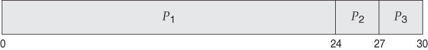
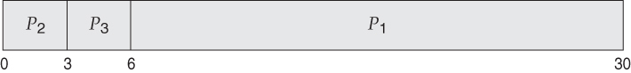



# CPU Scheduling

> CPU를 프로세스 간에 교환하면서 생산성↑


## 1. Basic Concepts

> 프로세스 대기 -> CPU는 놀게 됨
>
> -> CPU 사용을 양도받을 수 있음

#### 1) CPU-I/O 버스트 사이클

- 프로세스 실행 = [CPU 실행 + I/O 대기] 의 사이클

  = CPU 버스트 -> I/O 버스트 -> CPU 버스트 -> I/O 버스트 -> CPU 버스트 -> ... -> CPU 버스트 -> 실행 종료

  

- 프로세스에서 짧은 CPU 버스트가 많음

- I/O 중심의 프로그램 - 짧은 CPU 버스트를 많이 가짐

- CPU 지향 프로그램 - 긴 CPU 버스트를 가질 수 있음

#### 2) CPU 스케줄러

- CPU가 유휴상태 -> 준비 큐에서 프로세스 하나 실행

  => 실행할 프로세스를 선택하는 건 **CPU 스케줄러**

- 큐에 있는 레코드는 일반적으로 PCB

#### 3) 선점 및 비선점 스케줄링

- CPU 스케줄링을 결정하는 상황
  1. 프로세스가 실행 -> 대기 상태로 전환
  2. 프로세스가 실행 -> 준비완료 상태로 전환
  3. 프로세스가 대기 -> 준비완료 상태로 전환
  4. 프로세스 종료
- 1, 4번의 상황: 비선점
- 2,3번의 상황: 선점

- 선점의 경우 생길 수 있는 문제

  ```
  1. A 프로세스 - [(자료 공유) x=10, y=20] - B 프로세스
  
  2. A 프로세스에서 x,y 수정 중
  
  3. B 프로세스 실행 -> x, y 읽기
  
  4. x, y => ??? (A와 B 각각에서 일관성 x)
  ```


#### 4) 디스패처

`CPU 코어의 제어 → CPU 스케줄러가 고른 프로세스에게 줌`

- 포함하는 작업

  - 문맥 교환
  - 사용자 모드로 전환
  - 프로그램 재시작을 위해 프로그램의 적절한 위치로 이동하는 일

- 디스패치 지연

  - 디스패치는 프로세스 문맥 교환 시 호출됨

    → 제일 빨리 실행돼야함

  - 디스패치 지연: 프로세스 정지 ~ 프로세스 수행시작 사이 소요시간


## 2. 스케줄링 기준

- 스케줄링 알고리즘 선택 전, 각 알고리즘의 특성 확인 필요

1. CPU 이용률
   - 최대한 CPU를 바쁘게 유지하는 것이 이상적
   - 실제로는 40% ~ 90% 범위를 가져야 함
2. 처리량
   - 처리량 = (완료된 프로세스 개수) / (단위 시간)
3. 총처리 시간
   - 프로세스의 제출 시간과 완료 시간의 간격
   - 준비 큐에서 대기한 시간 + CPU에서 실행한 시간 + I/O시간
4. 대기 시간
   - 준비 큐에서 대기하면서 보낸 시간의 합
5. 응답 시간
   - request 후 response가 오기까지의 시간

- 대부분의 경우 **평균 측정 시간**을 최적화하려고 함
- 경우에 따라 최소, 최대를 최적화하는 것이 좋을수도 있음


## 3. 스케줄링 알고리즘

- 준비 큐에 있는 프로세스 중 어떤 것을 CPU에 할당할지 결정

#### 1) 선입 선처리 스케줄링

> First-Come, First-Served (FCFS)
>
> 먼저 요청하는 프로세스에 CPU 할당

- 선입선출 큐로 쉽게 관리 가능

- CPU가 가용상태가 되면 준비 큐의 앞에 있는 프로세스에 할당

- 단점: 평균대기 시간이 길어질 수 있음

  - 예시 (간트 차트)

  ※ 간트 차트: 참여한 각 프로세스의 시작/종료 시각을 포함해 스케줄 기법을 도시하는 막대차트

  

  

  - 위 그림에서 평균 대기 시간 = (0 + 24 + 27) / 3 = 17
  - 아래 그림에서 평균 대기 시간 = (0 + 3 + 6) / 3 = 3

  

- 호위 효과: 하나의 프로세스가 CPU를 양도하기를 모든 프로세스가 기다리는 것

  => 짧은 프로세스가 먼저 처리되도록 허용될 때보다 CPU와 장치 이용률이 저하됨

- 비선점형 -> 한 번 CPU가 할당되면 (프로세스 종료 or I/O 등)으로 CPU를 방출할 때까지 CPU 점유

  

  

  

  


