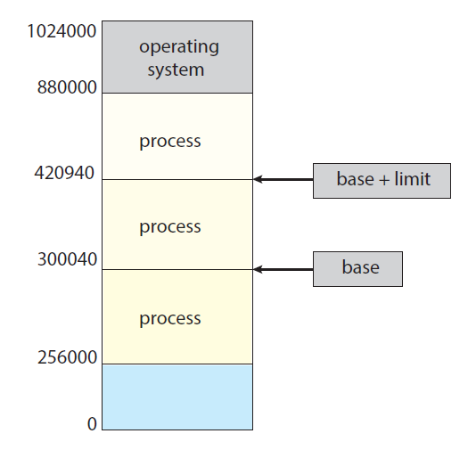
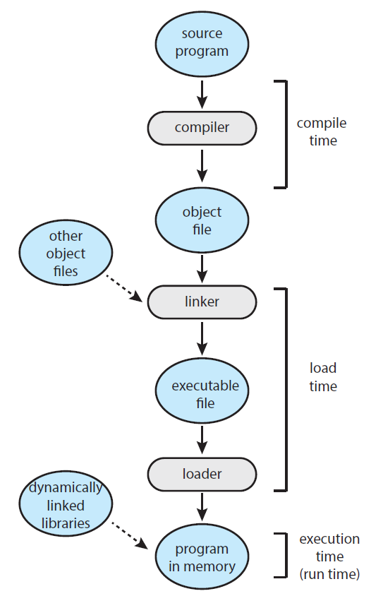
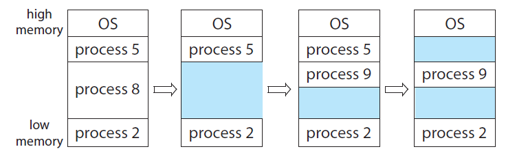



# Main Memory

## 1. Background
#### 1) 메모리 공간

- 프로세스는 각각의 메모리 공간을 가진다.
- 레지스터 = base 레지스터 + limit 레지스터
  - base 레지스터: 프로세스의 시작 위치를 저장
  - limit 레지스터: 프로세스에게 할당된 메모리의 크기
- 프로세스가 논리주소공간을 base 레지스터와 limit 레지스터로 지정
  - base 레지스터 <= 논리주소 공간 <= base 레지스터 + limit 레지스터

- 다른 프로세스의 메모리에 접근하지 못하게 한다.

#### 2) 주소 바인딩

- 프로그램은 컴파일 후 메모리에 올라간다.
  - 컴파일러는 심볼릭 주소를 relocatable 주소로 바인딩
  - 링커(또는 로더)는 relocatable 주소를 절대 주소로 바인딩
- logical address: CPU에 의해 발생하는 메모리 주소
- physical address: 실제로 접근해야하는 메모리 주소
- 

- MMU(Memory Management Unit): 논리 주소를 물리 주소로 매핑

##### Dynamic Loading

- 모든 프로세스를 메모리에 올리기엔 메모리 크기 제한이 있음
- **필요할 때 메모리에 올리는 방법**

##### DLLs(Dynamically Linked Libraries)

- dynamic linking: 실행이 될 때 라이브러리 파일을 링킹	
  - cf) static linking: 컴파일 시 라이브러리가 링킹, 실행 파일(bin 파일)에 포함됨

- shared library: 메인 메모리에 한번 올라가면 다른 프로세스에서도 공유

## 2. 연속 메모리 할당

> 연속적인 메모리 할당에서 각 프로세스는 다음 프로세스가 적재된 영역과 인접한 영역에 적재된다.

#### 1) 메모리 보호

- 프로세스가 자신이 소유하지 않은 메모리를 접근할 수 없게 강제할 수 있음
  - relocation 레지스터 + limit 레지스터
- 가상 주소값이 limit 레지스터보다 크면 error(fault)를 발생시킴

#### 2) 메모리 할당

- 가변 파티션 기법: 프로세스를 가변 크기 파티션에 할당
  - 각 파티션에는 하나의 프로세스만 적재
- **hole** : 하나의 큰 사용 가능한 메모리 블록
- 

- 메모리가 충분하지 않으면
  1. 프로세스를 거부하고 적절한 오류 메시지 제공
  2. 프로세스를 대기 큐에 넣기

- **동적 메모리 할당 문제**: 가용 공간(free holes) 리스트에서 n바이트 블록 요구를 어떻게 만족시킬 것인가

  1. 최초 적합: 첫번째 사용 가능 공간 할당
  2. 최적 적합: 사용 가능 공간 중 가장 작은 것을 선택
  3. 최악 적합: 가장 큰 가용 공간 선택

  - 최초 적합이 일반적으로 속도가 빠름