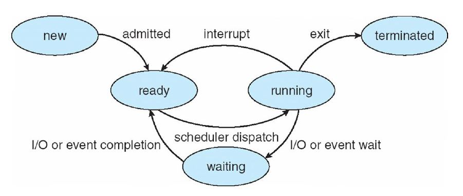

# Process
## 1. Process Concept
> 실행중인 프로그램
>
> 작업의 단위

- 작업을 수행하기 위해 특정 자원이 필요하다
  - CPU time, 메모리, 파일, I/O device

#### 1) 메모리 영역

- Text 영역: 실행가능한 코드
- Data 영역: 전역 변수
- Heap 영역: 프로그램 실행 중 **동적으로 할당되는 메모리**
- Stack 영역: 함수 파라미터, 지역 변수 등 일시적인 데이터 저장공간


#### 2) 프로세스 상태



- New: 프로세스가 생성됨
- Running: cpu를 점유해서 프로세스의 명령 실행

- Waiting: 이벤트 발생을 대기
- Ready:  cpu 점유할 준비가 된 상태
- Terminated: 프로세스가 종료됨


#### 3) 프로세스 관리

- TCB(Task Control Block)

- PCB (Process Control BLock)
  - 프로세스 상태
  - 프로그램 카운터
  - CPU 레지스터
  - CPU 스케줄링 정보
  - 메모리 관리 정보
  - 계정 정보
  - I/O 상태 정보


#### 4) 프로세스

- 프로세스란
  - 하나의 흐름(thread, 가닥)에서 실행되는 프로그램
- 한 개의 흐름에서는 한번에 하나의 task만 수행할 수 있다.
- 여러 가닥의 흐름 -> 한번에 여러 task를 수행할 수 있도록 함

- 스레드(thread)는 가벼운 프로세스이다.
  - 대부분 멀티프로세스 < 멀티스레드


## 2. Process Scheduling

#### 1) 멀티프로그래밍의 목적

- 동시에 여러 프로세스 실행
- CPU 사용효율을 극대화하기 위함

#### 2) time sharing의 목적

- CPU 코어를 프로세스간에 자주 전환 => 각 프로그램이 동시에 실행되고 있는 것처럼 보이게 함

#### 3) 스케줄링 큐

- Ready queue: 프로세스는 처음에 ready 큐에 놓여진다. (CPU 코어 사용 대기)
- Wait queue: 특정 이벤트 발생을 기다리는 경우 wait 큐에 놓여진다.

- 각 큐는 linked list

#### 4) 문맥 교환

- 문맥: PCB 정보
- 인터럽트 발생 -> 현재 context 저장(pc) -> 후에 다시 시작되면 context 복원
- 문맥 교환: CPU 코어를 다른 프로세스로 넘겨주는 것
  - 현재 프로세스의 상태 저장 & 다른 프로세스의 상태 복원
- 프로세스 상태가 변할때(executing 화살표 전후) 문맥교환


## 3. Operations on Processes

- OS는 프로세스를 생성/종료 한다.

#### 1) 프로세스 실행의 2가지 경우

- 부모 프로세스가 자식 프로세스와 **동시에 실행**
- 부모 프로세스가 자식 프로세스가 종료될 때까지 **대기**

#### 2) 주소 공간 할당의 2가지 경우

- 부모 프로세스와 자식 프로세스가 같은 곳 (PCB, PC만 따로)
- 자식 프로세스 실행을 위해 새 프로그램 로딩

#### 3) 프로세스 종료

- 마지막 문장 실행
- exit() 호출
- OS가 모든 자원의 메모리 해제 및 회수
  - 동적 할당한 메모리, 파일, I/O 버퍼 등

#### 4) zombie, orphan process

```
부모 프로세스는
1) 자신의 작업을 실행하거나
2) 자식 프로세스가 실행되는 동안 대기
  -> wait() 호출
  -> 자식 프로세스가 종료될 때까지 ready queue에서 자기자신을 제외
```

- zombie 프로세스: 부모 프로세스가 wait()을 호출하지 않고 자신의 작업을 실행중인 경우
  - 자식 프로세스 종료가 먼저
- orphan 프로세스: 부모 프로세스가 wait()을 호출하지 않고 끝나버린 경우
  - 부모 프로세스 종료가 먼저
