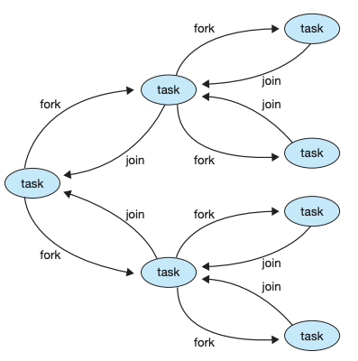
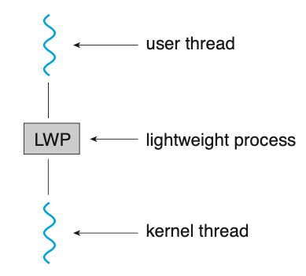
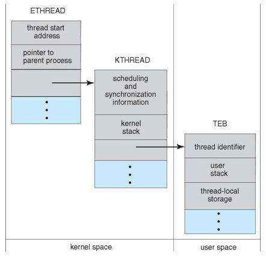



# Thread

## 1. Thread
> 1개의 프로세스 - 1개의 작업
>
> => 한계가 있다

#### 1) 스레드

- CPU를 사용하는 기본 단위
- 같은 프로세스에 속하는 스레드끼리 **자원을 공유**한다.

#### 2) 다중 스레드


- 단일 스레드: 하나의 작업

- 다중 스레드: 스레드 당 하나의 작업 ⇒ 여러 작업을 한번에

  - ex) 워드: 스레드1- `그래픽 표시`, 스레드2- `키 입력 응답`, 스레드3- `문법 검사`

- 왜 다중 스레드??

  ⇒ 새 작업을 수행할 프로세스 만들기 << 스레드 실행 (시간, 자원 사용 면에서 더 좋음)

- 다중 스레드의 장점

  - 1) 응답성

    - 단일 스레드면 현재 작업이 끝날 때까지 기다려야함 (응답하지 않음)

  - 2) 자원 공유

    - **프로세스**끼리의 자원 공유(공유메모리, 메시지 전달)는 개발자의 처리가 필요
    - 프로세스 내의 **스레드**끼리 자원을 공유할 수 있음

  - 3) 경제성

    - 새 프로세스를 만드는 것은 비용이 많이 듦

    - 스레드끼리 문맥교환하는 것이 더 경제적

      +프로세스끼리의 문맥교환보다도 빠름

  - 4) 규모 적응성


## 2. 다중코어 프로그래밍

- 코어: CPU의 기본 계산 단위

#### 1) 단일 코어 vs 다중 코어


-> 각각의 스레드마다 작업을 담당하지만 한번에 한 작업밖에 수행하지 못함


-> 한번에 여러 작업 수행 가능 (ex- 시점2에 3,4번 작업 수행)


#### 2) 병행성, 병렬성

- 병행성: 동시 작업
- 병렬성: 동시 수행
- 위의 단일 코어 그림에서 스레드 전환이 빠르면 1~4번 작업이 동시에 진행되는 것으로 보임(병행성)
   **but** 한번에 한 스레드만 실행 중(병렬성x)

> 병렬 수행이 될 수 있도록 코어 활용


#### 3) 병렬 실행

- 데이터 병렬 실행
- 태스크 병렬 실행


## 3. 다중 스레드

- 사용자 스레드 vs 커널 스레드
  - 사용자 스레드: 라이브러리 등으로 이용하는 스레드 (커널 지원x)
    - 스레드 라이브러리가 스레드 생성,제거,스케줄링,문맥교환 등을 수행
    - 커널은 사용자 스레드의 존재를 모름
  - 커널 스레드: 커널 내에 있는 스레드
    - 스레드 생성, 스케줄링 등을 커널이 수행

#### 1) 다중 스레드 모델

- 다대일 모델 (n:1)
  - n개의  사용자 스레드가 1개의 커널 스레드로 매핑
  - 1개의 스레드가 봉쇄형 시스템 콜 호출 → 전체 봉쇄
  - 1개의 스레드만 커널에 접근 가능 → 다중의 의미가 x

- 일대일 모델 (1:1)
  - 1사용자 스레드 - 1커널 스레드
  - 병렬성 👍
  - 각각 사용자 스레드마다 커널 스레드 → 성능 부담의 가능성
  - Linux, Windows

- 다대다 모델 (n:m)
  - n개의 사용자 스레드가 m개의 커널 스레드로 매핑 (n≥m)
  - 1개의 스레드가 봉쇄형 시스템 콜 호출 → 다른 커널 스레드가 수행
  - 성능 부담때문에 스레드 수를 제한하지 않아도 됨
  - 1사용자 스레드 - 1커널 스레드 ⇒ 일대일 모델처럼 보일수도 있음


## 4. 스레드 라이브러리

1. POSIX

- Pthreads

2. Windows

3. Java

- Runnable, Future, CompletableFuture


## 5. 암묵적 스레딩

> 스레드의 생성, 관리를 컴파일러, 실행시간 라이브러리에게 넘김

#### 1) 다중 스레드 서버의 문제

- 스레드를 생성하는 데 소요되는 시간
- 최대 스레드 수를 정해야 함 (무한개 만들 수는 없으니까)

#### 2) 스레드 풀


1. 스레드를 미리 만들어놓는다
2. 요청이 들어온다
3. 풀에 사용가능한 스레드가 있으면 해당 작업을 수행한다
   - 없으면 생길때까지 대기
4. 작업이 끝나면 풀로 스레드를 반환한다

- 장점
  - 새 스레드를 만드는 것보다 효율이 좋음
  - 스레드 개수를 미리 제한할 수 있음
  - 태스크를 생성하는 방법을 태스크로부터 분리하면 태스크를 실행을 다르게 할 수 있음, 태스크를 일정 시간 후에 실행되도록 스케줄 하거나 혹은 주기적으로 실행시킬 수 있음???


#### 3) Fork-Join

- 새로운 스레드(fork)가 작업을 처리하고 끝나면 합쳐짐(join)
- 분할정복과 유사한 구조



#### 4) OpenMP

- 공유메모리 병렬 프로그래밍 API & 컴파일러 지시어 (C, C++, 포트란)

- 컴파일러 지시어 사용 

  ```
  #progma omp parallel{}
  ```

  

#### 5) Grand Central Dispatch

- 애플에서 개발한 기술

#### 6) Intel TBB

-  C++


## 6. 스레드 관련 문제

- 다중 스레드 프로그램 설계 시 고려해야 할 점

#### 1) Fork(), Exec() 시스템 콜

- Fork 를 통해 자식 프로세스를 만들 때
  - **모든 스레드** 복제
  - 한 개의 스레드만 복제

1. 스레드 내 exec() 호출

   → fork()를 호출한 스레드만 복제

   ∵ exec() 호출 → 새로운 프로그램으로 대체

2. 스레드 내 exec() 호출x

   → 모든 스레드 복제

#### 2) 시그널 처리

- 신호 (signal): 이벤트 발생을 프로세스에게 알림
  - 특정 이벤트가 일어나야 생성되고 프로세스에게 전달됨
  - 전달된 시그널은 반드시 처리되어야 함
- 동기식 시그널: 시그널 발생의 원인이 되는 프로세스로 전달
- 비동기식 시그널: 다른 프로세스로 전달 (ex- ctrl+c 입력)

> 프로세스에 시그널이 전달된다면?

1. 동기식: 시그널을 발생시킨 스레드로 전달되면 됨
2. 비동기식 시그널
   - 시그널이 적용될 스레드
   - 모든 스레드
   - 몇몇 스레드
   - 특정 스레드가 모든 시그널을 전달받도록 지정


#### 3) 스레드 취소

- 스레드 취소: 스레드 정상종료 전 강제 종료시키는 작업

- 목적 스레드: 취소되어야할 스레드

1. 비동기식 취소: **한 스레드**가 목적 스레드를 강제 종료시킨다.
2. 지연 취소: **목적 스레드**가 자신이 강제 종료되어야할지 주기적으로 점검한다.

> 스레드 취소 시 스레드에 할당된 자원의 처리 (+공유자원)

- 지연 취소 ⇒ 스레드 자신이 취소되어도 안전하다고 판단될 때 취소 여부를 검사


#### 4) 스레드-로컬 저장장치 (TLS)

- 스레드끼리는 해당 프로세스의 데이터를 공유

  → 스레드 **자신**만의 데이터가 필요할 수 있음 (= TLS)

- 각각의 스레드 별 고유한 전역변수

  - 스레드 내에서 전역변수처럼 사용
  - 프로세스 관점에서, 하나의 스레드 내에서만 지역변수처럼 사용


#### 5) 스케줄러 액티베이션

> 스레드 라이브러리 - 커널의 통신 (다대다 통신)

- 중간 자료구조를 둔다. (= 경량 프로세스, LWP)
- LWP는 커널 스레드마다 있어야 한다.
- LWP가 없으면 서로(사용자↔커널)의 상태를 알 수 없음(=통신x)



- 스케줄러 액티베이션: 스레드 라이브러리-커널 스레드 통신 방법 중 하나
  1. 커널이 어플리케이션에 가상 처리기(LWP)의 집합을 제공
  2. 어플리케이션은 가상 처리기로 스케줄
  3. 커널은 특정 이벤트에 대해 어플리케이션에게 알림(ex-스레드 봉쇄)
     - 이 프로시저를 upcall 이라 한다.

- 예시

  ```c
  # (1) 초기
  1,2 스레드 - LWP - a 커널
  3,4 스레드 - LWP - b 커널
  
  # (2) 스레드2에서 I/O 이벤트 발생
  1,2 스레드 - LWP - a 커널 => waiting 상태
  3,4 스레드 - LWP - b 커널
  - 스레드1은 waiting 상태인지 모름 (사용자 스레드 입장)
  
  # (3) upcall
  - 커널이 LWP에게 상태를 알림
  
  # (4) 재할당
  2 스레드 - LWP - a 커널 => waiting 상태
  1,3,4 스레드 - LWP - b 커널
  - 스레드1을 옮김
  
  # (5) 스레드2에서 I/O 종료
  - 커널이 LWP에게 상태를 알림
  ```


## 7. Thread in OS

#### 1) Windows

- 사용자 스레드-커널 스레드 1:1
- 스레드 구성요소
  - `스레드 ID`: 스레드 식별자
  - `레지스터 집합`: 처리기 상태를 나타냄
  - `프로그램 카운터`
  - `사용자 스택 및 커널 스택`: 사용자 모드 및 커널 모드에서 실행될 때 필요
  - `개별 데이터 저장 영역`: 실행 시간 라이브러리, 동적 링크 라이브러리 등이 사용
- Windows 스레드의 구조



#### 2) Linux

- clone() 시스템 콜 → 스레드 생성

- 프로세스, 스레드 구별x ⇒ `태스크`

- clone() 호출 시 플래그 (공유 수준)

  1. CLONE_FS: 파일 시스템 정보
  2. CLONE_VM: 메모리 공간
  3. CLONE_SIGHAND: 신호 처리기
  4. CLONE_FILES: 열린 파일의 집합
  5. 등등...

  - 1~4 모두 지정 시 일반적인 스레드 생성과 같음
  - 지정하지 않으면 fork() 호출과 같음