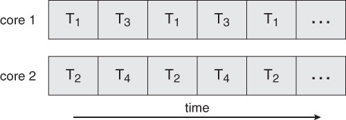

# Thread

## 1. Thread
> 1개의 프로세스 - 1개의 작업
>
> => 한계가 있다

#### 1) 스레드

- CPU를 사용하는 기본 단위
- 같은 프로세스에 속하는 스레드끼리 **자원을 공유**한다.

#### 2) 다중 스레드

- 단일 스레드: 하나의 작업

- 다중 스레드: 스레드 당 하나의 작업 ⇒ 여러 작업을 한번에

  - ex) 워드: 스레드1- `그래픽 표시`, 스레드2- `키 입력 응답`, 스레드3- `문법 검사`

- 왜 다중 스레드??

  ⇒ 새 작업을 수행할 프로세스 만들기 << 스레드 실행 (시간, 자원 사용 면에서 더 좋음)

- 다중 스레드의 장점

  - 1) 응답성

    - 단일 스레드면 현재 작업이 끝날 때까지 기다려야함 (응답하지 않음)

  - 2) 자원 공유

    - **프로세스**끼리의 자원 공유(공유메모리, 메시지 전달)는 개발자의 처리가 필요
    - 프로세스 내의 **스레드**끼리 자원을 공유할 수 있음

  - 3) 경제성

    - 새 프로세스를 만드는 것은 비용이 많이 듦

    - 스레드끼리 문맥교환하는 것이 더 경제적

      +프로세스끼리의 문맥교환보다도 빠름

  - 4) 규모 적응성

## 2. 다중코어 프로그래밍

- 코어: CPU의 기본 계산 단위

#### 1) 단일 코어 vs 다중 코어

-> 각각의 스레드마다 작업을 담당하지만 한번에 한 작업밖에 수행하지 못함

-> 한번에 여러 작업 수행 가능 (ex- 시점2에 3,4번 작업 수행)

#### 2) 병행성, 병렬성

- 병행성: 동시 작업
- 병렬성: 동시 수행
- 위의 단일 코어 그림에서 스레드 전환이 빠르면 1~4번 작업이 동시에 진행되는 것으로 보임(병행성)
   **but** 한번에 한 스레드만 실행 중(병렬성x)

> 병렬 수행이 될 수 있도록 코어 활용

#### 3) 병렬 실행

- 데이터 병렬 실행
- 태스크 병렬 실행

## 3. 다중 스레드

- 사용자 스레드 vs 커널 스레드

#### 1) 다중 스레드 모델

- 다대일 모델 (n:1)
  - n개의  사용자 스레드가 1개의 커널 스레드로 매핑
  - 1개의 스레드가 봉쇄형 시스템 콜 호출 → 전체 봉쇄
  - 1개의 스레드만 커널에 접근 가능 → 다중의 의미가 x

- 일대일 모델 (1:1)
  - 1사용자 스레드 - 1커널 스레드
  - 병렬성 👍
  - 각각 사용자 스레드마다 커널 스레드 → 성능 부담의 가능성
  - Linux, Windows

- 다대다 모델 (n:m)
  - n개의 사용자 스레드가 m개의 커널 스레드로 매핑 (n≥m)
  - 1개의 스레드가 봉쇄형 시스템 콜 호출 → 다른 커널 스레드가 수행
  - 성능 부담때문에 스레드 수를 제한하지 않아도 됨
  - 1사용자 스레드 - 1커널 스레드 ⇒ 일대일 모델처럼 보일수도 있음

## 4. 스레드 라이브러리

1. POSIX

- Pthreads

2. Windows

3. Java

- Runnable, Future, CompletableFuture

## 5. 암묵적 스레딩

> 스레드의 생성, 관리를 컴파일러, 실행시간 라이브러리에게 넘김

#### 1) 다중 스레드 서버의 문제

- 스레드를 생성하는 데 소요되는 시간
- 최대 스레드 수를 정해야 함 (무한개 만들 수는 없으니까)

#### 2) 스레드 풀

1. 스레드를 미리 만들어놓는다
2. 요청이 들어온다
3. 풀에 사용가능한 스레드가 있으면 해당 작업을 수행한다
   - 없으면 생길때까지 대기
4. 작업이 끝나면 풀로 스레드를 반환한다